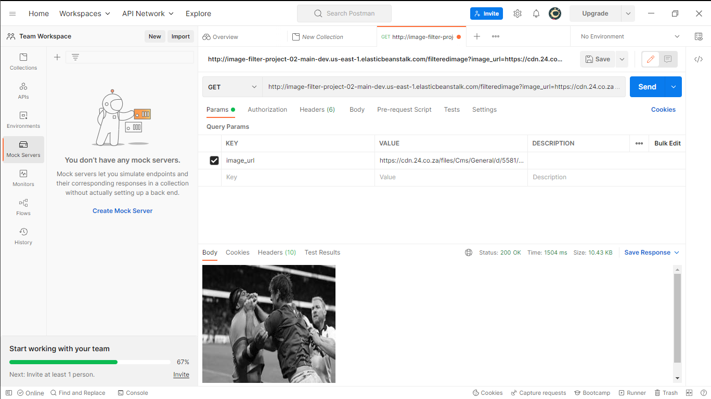

# Udagram Image Filtering Microservice

Udagram is a simple cloud application developed alongside the Udacity Cloud Engineering Nanodegree. It allows users to register and log into a web client, post photos to the feed, and process photos using an image filtering microservice.



## Documentation & Testing Resources

For detailed instructions on completing the project and verifying its functionality, refer to the following resources in the `/docs` directory:

- **manual.pdf**: Step-by-step manual for setup and deployment.
- **guide.md**: Comprehensive guide covering configuration and usage.
- **docs/postman**: Contains a Postman collection with example queries for testing API endpoints.

Review these files to ensure proper setup and to test all features of the Udagram Image Filtering Microservice.

## Project Structure

```
.
├── docs                        # Documentation and screenshots
│   ├── guide.md
│   ├── images
│   │   └── screenshots/
│   ├── manual.pdf
│   └── postman/
├── LICENSE
├── package.json
├── package-lock.json
├── README.md
├── src
│   ├── server.ts               # Main server implementation
│   └── util/                   # Image processing utilities
├── tree.txt
├── tsconfig.json
├── tslint.json
└── www                         # Compiled JavaScript Files
    ├── package.json
    ├── server.js
    ├── server.js.map
    ├── tmp                     # Create this empty older
    └── util
        ├── util.js
        └── util.js.map
```

## Creditshttps:

- **Starter Code**: [Udacity Cloud Developer Course](https://github.com/udacity/cloud-developer/tree/master)
- This project was developed as part of the Udacity Cloud Engineering Nanodegree program.

## License

This project is licensed under the terms described in the [LICENSE](./LICENSE) file.

---
